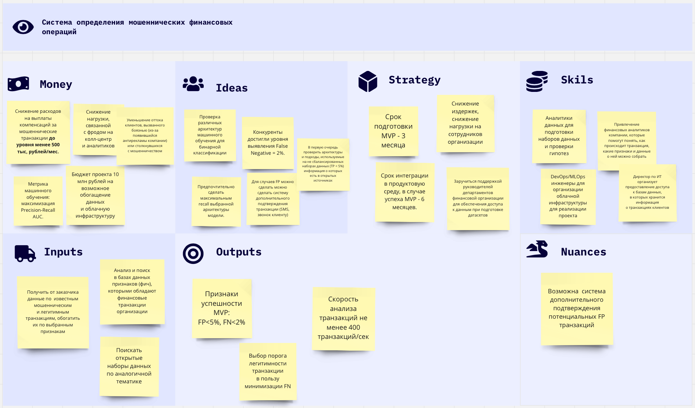

## 1. Цель проекта
Разработка MVP и запуск системы определения мошеннических финансовых транзакций для минимизации суммарного ущерба
клиентов до уровня менее 500 тыс. рублей в месяц.

## 2. Метрика машинного обучения:
Поскольку набор данных очень несбалансирован по классам, в качестве метрики машинного обучения выбирается метрика -
максимизация площади под кривой Precision-Recall (Precision-Recall AUC).

Критерии успешности MVP: FP < 5%, FN < 2%

## 3. Анализ особенностей проекта

## 4. Функциональные части планируемой системы
1. Виртуальная машина с Apache Airflow
2. Периодически запускаемый Spark-кластер
3. Облачное хранилище S3
4. Реестр моделей MLFlow
5. Apache Kafka-кластер
6. Kubernetes-кластер

## 5. Задачи
1. Провести предварительный анализ проекта. Предварительный анализ должен включить в себя выбор бизнес метрик и 
   метрик машинного обучения, анализ задач и особенностей проекта. Срок выполнения 20.02.2024.
2. Запуск и первоначальная настройка облачной инфраструктуры в виде виртуальных машин Spark cluster и облачного 
   хранилища s3, с помощью которых предполагается обработка данных. Эти виртуальные машины необходимы для
   совместной работы команды над созданием и обработкой набора данных и модели. Опционально - написать 
   terraform-скрипт для разворачивания Spark-кластера. Срок выполнения 21.02.2024.
3. Подготовить механизм очистки набора данных. Написать скрипт с использованием Apache Spark для анализа основных 
   проблем и очистки предложенного набора данных, с сохранением результатов в новый S3-bucket в формате parquet. 
   Срок выполнения 22.02.2024.
4. Настроить периодическую очистку данных. Установить Apache Airflow и создать DAG-скрипты для периодического запуска 
   Spark-кластера в облаке и запуска процедуры очистки обучающего набора данных, обновляемого из озера данных 
   компании. Срок выполнения 23.02.2024.
5. Создать механизм переобучения модели. Имплементировать PySpark для обучения модели fraud detection, а также 
   запустить MLFlow для сохранения в S3 всех артефактов работы с моделью. Настроить переобучение по расписанию с помощью 
   Apache Airflow. Срок выполнения 24.02.2024.
6. Настроить валидацию и анализ модели. Выбрать стратегию валидации, написать и добавить в AirFlow DAG-скрипт для 
   оценки метрик модели, A/B-тестирования новых моделей. Срок выполнения 25.02.2024.
7. Сделать систему инференса модели на потоке. Используя Spark Streaming создать Spark job, применяющий модель к 
   данным из одного топика Apacke Kafka и записывающим результат в другой топик. Срок выполнения 26.02.2024.
8. Создать REST-интерфейс инференса модели. Написать Python REST API для инференса модели, а также CI/CD pipeline c 
   тестированием, сборкой Docker-контейнера, публикацией в registry, а также запустить деплоймент в облачном k8s 
   кластере. Срок выполнения 27.02.2024.
9. Создать мониторинг метрик модели. Организовать генерацию prometheus-метрик в веб-сервисе модели, собрать метрики 
   в prometheus, создать дашборды и алертинг по метрикам в grafana. Срок выполнения 28.02.2024. 

